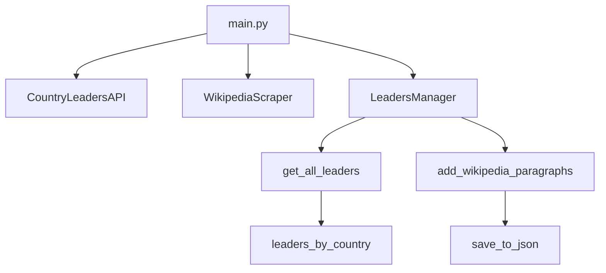

# Wikipedia Scraper

Consolidates political leader data by:
- Retrieving countries and leaders from the `country-leaders` API
- Scraping the first paragraph from each leader’s Wikipedia page
- Cleaning and saving the results

Project type: Consolidation | Duration: 3 days | Deadline: 31/10/2025 4:00 PM | Team: Solo

## Mission Objectives
- Create a self‑contained Python environment (venv)
- Retrieve information from an external API with cookies
- Scrape Wikipedia pages that do not provide an API
- Sanitize and persist the output (JSON)

Learning objectives:
- Use `venv`, `requests`, `BeautifulSoup`, proper exception handling, and JSON
- Optional: OOP, regex text cleaning, and multiprocessing/threads for speedup

## Architecture
- `app/api_client.py`: API client with per‑thread `requests.Session` and automatic cookie refresh
- `app/wikipedia_scraper.py`: HTML parsing and text cleaning for the first paragraph
- `app/leaders_manager.py`: Orchestrates API calls and Wikipedia scraping
- `app/main.py`: main

### Flow (high‑level)



## Installation
```bash
python -m venv wikipedia_scraper_env
source wikipedia_scraper_env/bin/activate
pip install -r requirements.txt
```

## Usage
Run the application and produce `leaders_with_paragraphs.json`:
```bash
python app/main.py
```

Output timing (example run):
```
Process completed successfully!
==================================================
Time taken to get all leaders: 1.5496060848236084 seconds
Time taken to add Wikipedia paragraphs: 17.183464288711548 seconds
Total time taken: 18.733084201812744 seconds
==================================================
```

## Features
Must‑have (MVP):
- Working pipeline that queries the API, scrapes the first paragraph, and writes JSON
- Clear exception handling and a readable README

Nice‑to‑have implemented:
- CSV export switch alongside JSON

Nice-to-have future:
- Async scraping via `aiohttp` for higher concurrency loads
- Implement threading or concurrency
- Optimize the algorithms
- Still readable code
- Add unit tests

